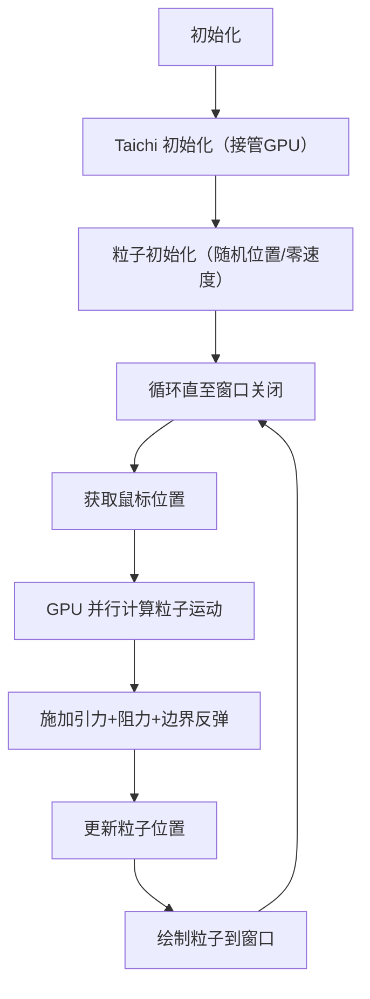
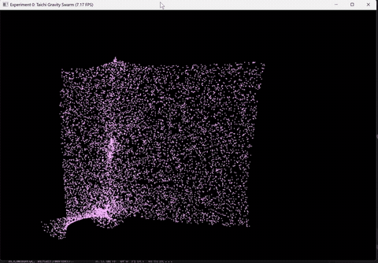

# CG-Lab: 万有引力粒子群仿真实验
本次实验基于现代 Python 工程规范与 Taichi 框架，实现了 GPU 加速的万有引力粒子群交互仿真，完成了“环境搭建-逻辑解耦-GPU计算-可视化”的完整图形学开发链路。
## 学生信息
202411998340 高小涵 计算机科学与技术

## 一、实验背景与核心目标
### 1.1 实验背景
现代计算机图形学开发需要兼顾**工程规范性**与**计算高性能**：
- 采用 `uv` 实现项目级环境隔离，避免依赖冲突；
- 基于 `src` 布局规范解耦代码逻辑，提升可维护性；
- 利用 Taichi 框架实现 GPU 并行计算，驱动大规模粒子群物理仿真。

### 1.2 核心目标
- 掌握 `uv` 包管理器的虚拟环境隔离能力；
- 理解图形学项目的 `src` 布局规范与代码解耦思想；
- 熟悉 Taichi 框架的 GPU 加速机制，实现并行化粒子仿真。

## 二、项目架构（src 布局规范）
### 2.1 目录结构
    CG-Lab/
    ├── src/           # 核心代码目录（Source Layout）
    │ └── Work0/       # 万有引力仿真模块
    │ ├── init.py      # 模块标识文件
    │ ├── config.py    # 参数配置（物理 / 渲染参数）
    │ ├── physics.py   # 物理计算核心（GPU 并行）
    │ └── main.py      # 主程序（初始化 + 渲染循环）
    ├── .gitignore     # Git 忽略规则（屏蔽虚拟环境 / 缓存文件）
    └── README.md      # 项目说明文档

### 2.2 模块职责
| 文件名 | 核心职责 |
|--------|----------|
| `config.py` | 集中管理所有可配置参数（粒子数量、引力强度、窗口分辨率等），无需修改代码逻辑即可调整效果 |
| `physics.py` | 定义粒子数据结构，实现初始化、引力计算、阻力、边界反弹等物理逻辑（Taichi 内核，GPU 并行执行） |
| `main.py` | 程序入口，初始化 Taichi/GUI，驱动物理计算与渲染循环，处理鼠标交互 |

## 三、代码核心逻辑
### 3.1 技术栈
- **环境管理**：uv（高性能 Python 包管理器，实现 `.venv` 虚拟环境隔离）；
- **计算框架**：Taichi（GPU 并行计算，自动编译至最优硬件后端）；
- **可视化**：Taichi GUI（轻量图形界面，支持鼠标交互与实时渲染）。

### 3.2 核心逻辑流程


### 3.3 关键特性
1. GPU 并行加速：physics.py 中 @ti.kernel 装饰的函数编译为 GPU 代码，数万粒子的计算可实时完成；
2. 交互性：粒子会跟随鼠标位置移动，模拟 “引力源” 效果；
3. 物理真实性：加入空气阻力（速度衰减）、边界反弹（能量损耗），符合现实物理规律；
4. 参数可配置：所有核心参数（粒子数、引力强度、粒子大小 / 颜色等）均可在 config.py 中一键调整。

## 四、功能实现与效果展示
### 4.1 运行方式
基于 uv 的模块化运行指令（无需手动激活虚拟环境）：
```bash
# 启动仿真程序
uv run -m src.Work0.main
```

### 4.2 效果演示
#### 4.2.1 交互演示 GIF 

- 鼠标移动时，粒子会向鼠标位置聚集（引力效果）；
- 粒子碰到窗口边界会反弹（带能量损耗）；
- 空气阻力会让粒子速度逐渐衰减，避免无限加速。

## 五、核心技术细节
### 5.1 uv 虚拟环境隔离
使用 uv 实现项目级环境隔离，避免全局 Python 环境污染：
```bash
# 初始化项目并创建 .venv 虚拟环境
uv init

# 安装 Taichi 依赖
uv add taichi

# 运行模块（自动使用虚拟环境）
uv run -m src.Work0.main
```
### 5.2 Taichi GPU 并行计算
核心物理计算通过 Taichi 内核实现，利用 GPU 并行处理每个粒子：
```python
# physics.py 核心片段
@ti.kernel
def update_particles(mouse_x: float, mouse_y: float):
    for i in range(NUM_PARTICLES):  # GPU 并行循环，每个粒子独立计算
        dir = ti.Vector([mouse_x, mouse_y]) - pos[i]  # 粒子到鼠标的方向
        vel[i] += dir.normalized() * GRAVITY_STRENGTH  # 施加引力
        vel[i] *= DRAG_COEF  # 空气阻力
        pos[i] += vel[i]     # 更新位置
        # 边界反弹逻辑...
```
## 六、实验总结
本次实验完成了以下核心目标：
- 掌握 uv 包管理器的虚拟环境隔离能力，实现项目级依赖管理；
- 遵循 src 布局规范，解耦配置、计算、渲染逻辑，提升代码可维护性；
- 利用 Taichi 框架实现 GPU 并行计算，完成大规模粒子群的实时交互仿真；
- 基于 Git 完成代码版本管理与远程仓库提交，符合工程化开发规范。
扩展方向
增加粒子间的相互引力（不仅受鼠标引力）；
自定义粒子颜色渐变 / 大小差异；
加入粒子碰撞检测与物理交互。

