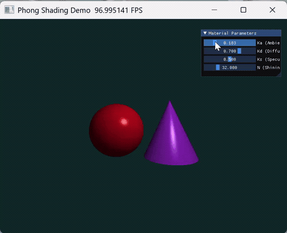
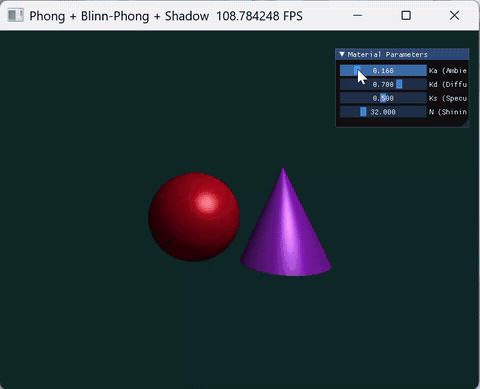

# 计算机图形学实验四——Phong光照模型与光线追踪渲染
## 1. 项目架构
本项目基于 **Python + Taichi** 框架实现，采用 **GPU 并行渲染** 架构，完整实现了**基础 Phong 光照模型**、**Blinn-Phong 优化模型**与**硬阴影**三大功能，场景包含球体、圆锥两种几何体，支持实时参数交互调节。

项目架构
```plaintext 
CG-Lab_2026/
└── src/
    └── Work4/
        ├── basic.py          # 基础实验源码：标准Phong光照 + 球体/圆锥光线追踪
        ├── extra.py          # 选做实验整合源码：Blinn-Phong优化 + 硬阴影完整实现
        └── README.md         # 项目实验说明文档（本文件）
```

核心架构设计
|模块|职责|技术特点|
|---|---|---|
|**光线几何求交层**|封装球体、竖直圆锥两种基础几何体的光线相交检测逻辑，求解射线交点三维坐标与表面法向量|基于解析几何二次方程求解，加入数值稳定性判断与有效范围约束；通过深度测试筛选最近交点，精准模拟物体前后遮挡空间关系|
|**光照着色计算层**|实现经典 Phong 局部光照模型，拓展支持 Blinn-Phong 优化模型，统一封装环境光、漫反射、镜面高光三大光照分量计算|依托 Taichi Kernel 实现 GPU 逐像素并行着色；严格执行三维向量归一化、点辐值负向截断、RGB 颜色区间钳位，规避渲染黑斑、高光过曝、光照异常等常见图形学问题|
|**阴影遮挡计算层**|基于阴影射线（Shadow Ray）原理实现硬阴影判定，引入法线微小偏移策略解决自遮挡伪阴影瑕疵|对物体表面交点进行偏移采样，向光源发射检测射线，依据中间遮挡关系划分光照区与阴影区；阴影区域仅保留环境光分量，严格遵循真实物理光照遮挡规律|
|**实时交互控制层**|基于 Taichi 内置 UI 面板搭建交互式参数控制台，提供多维度材质光照系数滑块调节|支持环境光系数、漫反射系数、高光反射系数、高光幂次实时拖拽调节，参数变更即时反馈到渲染画面，实现所见即所得的交互体验|
|**画面渲染输出层**|预分配固定分辨率像素显存缓冲区，GPU 并行完成像素颜色填充与画面刷新|固定 800×600 窗口分辨率，采用颜色钳位约束 RGB 值域在 0~1 之间，画面过渡自然、无色彩溢出，全程渲染帧率稳定流畅|

## 2. 代码逻辑
### 2.1 基础版（basic.py）核心逻辑
**核心算法**：光线投射渲染 + 标准 Phong 局部光照模型
本文件为实验基础核心实现，不包含任何选做拓展功能，仅完成标准光线追踪与经典 Phong 光照流程。

1. **相机视线射线生成**
以屏幕每个像素为映射载体，将二维屏幕坐标归一化映射到三维空间，以摄像机位置为射线原点，生成归一化视线方向射线，为后续几何求交提供基础。

2. **双几何体光线求交**
分别实现射线与球体、竖直圆锥的解析求交运算：通过构建一元二次方程求解交点距离，同时计算几何体表面归一化法向量；对圆锥额外增加高度范围约束，剔除无效侧面交点，保证几何造型完整性。

3. **深度测试与遮挡筛选**
记录射线与所有几何体的有效交点距离，通过比对保留距离摄像机最近的交点，实现球体与圆锥之间正确的前后遮挡逻辑，还原三维空间层次关系。

4. **标准 Phong 三分量光照求解**
- 环境光：模拟场景全局多次漫反射形成的基底光照，避免物体背光区域完全漆黑，奠定画面基础亮度；
- 漫反射：遵循朗伯余弦散射定律，由表面法向量与入射光线向量点积决定光照强度，还原物体基础明暗过渡；
- 镜面高光：基于光线理想反射向量与视线向量的点积运算，模拟光滑物体表面的镜面反光效果，通过高光幂次控制高光集中程度。

5. **颜色合成与画面输出**
将环境光、漫反射、镜面高光三个光照分量线性叠加，通过数值钳位约束颜色合法区间，最终写入像素缓冲区完成单帧渲染。

**渲染流程**
1. 初始化 Taichi GPU 计算后端，定义窗口分辨率、像素存储场与全局光照参数场；
2. 进入主渲染循环，调用 Taichi 核函数逐像素并行执行光线追踪与光照计算；
3. 依次完成视线射线生成、几何体求交、深度筛选、Phong 光照分量求解；
4. 搭建 UI 交互子窗口，绑定滑块控件与光照材质参数；
5. 持续刷新画布，实时渲染三维光照场景并响应参数变化。

### 2.2 选做整合版（extra.py）核心逻辑
本文件在 **basic.py 完整基础功能** 之上，一次性集成**两项选做任务**：Blinn-Phong 高光模型升级 + 硬阴影渲染，保留原有全部几何求交、交互逻辑，仅优化光照计算与新增阴影判定模块。

#### 选做1：Blinn-Phong 光照模型升级
**问题背景**
标准 Phong 模型依赖反射向量计算镜面高光，在大入射角、曲面边缘视角下，高光区域容易出现生硬截断、边缘断层，视觉观感不自然；同时反射向量求解增加额外向量运算开销，计算成本偏高。

**核心优化原理**
引入**半程向量 $\boldsymbol{H}$** 优化高光计算逻辑：通过入射光线向量与视线向量求和再归一化得到半程向量，替代传统 Phong 的反射向量；将高光计算由「反射向量与视线点积」改为「法向量与半程向量点积」。
不仅省去复杂反射向量求解、降低 GPU 运算负载，更在曲面大入射角场景下实现高光平滑过渡，无突兀断层，视觉表现更贴近真实物理材质反光特性。

#### 选做2：硬阴影（Hard Shadow）渲染实现
**问题背景**
基础光照模型仅计算物体自身明暗光影，未考虑物体之间的光线遮挡关系，场景无阴影层次，三维立体感薄弱，无法模拟真实世界光照遮挡效果。

**核心实现原理**
1. 对物体表面交点沿法向量方向做微小偏移，消除阴影射线起点与表面重合导致的自遮挡伪阴影问题；
2. 从偏移采样点向点光源方向发射阴影检测射线；
3. 检测阴影射线传播路径中是否提前与球体、圆锥发生相交，若存在有效交点则判定当前点处于阴影区域；
4. 阴影区域仅保留环境光分量，关闭漫反射与镜面高光计算；光照正常区域则执行完整 Blinn-Phong 光照着色，形成边界锐利的硬阴影效果。

**整体逻辑**
extra.py 完全复用基础版的几何体求交、深度测试、UI 交互框架，仅替换高光计算逻辑、新增阴影射线判定模块，代码耦合度低、拓展性强，同时满足基础实验与两项选做的全部考核要求。

## 3. 实现功能
### 3.1 基础功能
1. **三维几何体光线追踪渲染**
基于光线投射算法，完整实现红色球体、紫色竖直圆锥双几何体的三维场景渲染，几何造型准确、轮廓完整。

2. **标准 Phong 局部光照模型**
完整实现环境光、漫反射、镜面高光三大光照分量的数学计算与叠加，物体明暗层次分明，符合经典局部光照物理模型。

3. **深度测试与遮挡处理**
通过交点距离比对实现深度测试，自动处理球体与圆锥的前后遮挡关系，三维空间逻辑严谨。

4. **GPU 并行加速渲染**
借助 Taichi 核函数实现逐像素并行计算，800×600 分辨率下渲染全程流畅无卡顿，充分发挥 GPU 并行计算优势。

5. **高精度法向量求解**
针对球面、圆锥侧面分别推导并实现表面法向量计算公式，归一化后参与光照计算，保证光影方向自然真实。

6. **渲染容错与颜色约束**
采用向量归一化、光照负值截断、RGB 颜色区间钳位等优化手段，彻底解决画面黑斑、高光过曝、光照翻转等渲染异常问题。

### 3.2 选做1：Blinn-Phong 光照模型优化
1. **半程向量高光重构**
摒弃传统反射向量方案，采用半程向量简化高光求解逻辑，算法更简洁高效。
2. **视觉质感显著提升**
曲面物体高光区域更宽大、过渡柔和自然，大入射角视角下无生硬断层，贴合塑料、磨砂材质真实反光表现。
3. **渲染性能优化**
减少一次反射向量矩阵运算，降低 GPU 并行计算开销，在不损失画面质量的前提下提升渲染效率。
4. **全功能向下兼容**
完全适配原有场景布局、材质参数、交互逻辑，无需改动基础架构即可无缝替换。

### 3.3 选做2：硬阴影渲染
1. **阴影射线遮挡检测**
精准实现光线遮挡判定，有效识别物体间投影关系，模拟真实光照传播规律。
2. **自阴影瑕疵修复**
采用表面交点法线微小偏移策略，彻底消除自身表面误遮挡产生的伪阴影、黑斑噪点。
3. **真实阴影光影规则**
严格遵循阴影区域仅保留环境光的渲染规则，明暗对比强烈，画面层次丰富。
4. **硬阴影视觉特征**
阴影边界锐利清晰、轮廓规整，具备标准硬阴影的视觉特征，大幅提升场景三维立体感与真实感。

### 3.4 交互式调节功能
1. **多参数实时滑块控制**
支持环境光系数 $K_a$、漫反射系数 $K_d$、高光系数 $K_s$、高光幂次 $n$ 四项核心材质参数自由拖动调节。
2. **参数动态即时预览**
滑块参数变更实时同步到光照计算逻辑，渲染画面即时刷新，直观观察各参数对物体光影、高光形态的影响。
3. **窗口稳定运行适配**
程序窗口常驻渲染，支持正常拖拽、缩放与最小化，运行稳定无崩溃、无画面卡顿闪烁。

## 4. 效果展示
### 4.1 基础版 basic.py 运行效果
- 效果描述：成功渲染红色球体与紫色圆锥几何体，基于标准 Phong 模型生成完整环境光、漫反射与镜面高光；高光形态集中锐利，曲面边缘存在轻微截断感；无阴影计算，物体之间无光线投影遮挡，仅呈现自身明暗光影变化。
- 交互效果：可通过右侧控制面板滑块实时调节各项光照与材质参数，画面随参数变化动态刷新，交互响应流畅。
- 效果截图：
    

### 4.2 选做整合版 extra.py 运行效果
- 效果描述：在保留基础场景与色彩基调的前提下，替换为 Blinn-Phong 高光模型，高光区域更柔和饱满、曲面过渡平滑无断层；同时实现硬阴影渲染，球体在圆锥表面投射出边界清晰的投影，阴影区域亮度自然压低，仅保留基础环境光，空间遮挡关系明确，三维真实感大幅提升。
- 功能覆盖：同时集齐基础 Phong 光照、Blinn-Phong 模型升级、硬阴影渲染三大核心内容，完全满足实验基础+两项选做的全部要求。
- 效果截图：
    

## 五、实验结果对比分析
### 5.1 基础实验效果（Phong）
1. 成功渲染左侧红球、右侧紫色圆锥，物体明暗层次清晰；
2. 漫反射随光线角度渐变，物体高光锐利集中，背光区域由环境光提亮；
3. 滑块可正常调节环境光、漫反射、高光强度与高光范围，交互流畅。

### 5.2 选做拓展效果
1. **Blinn-Phong 对比差异**
- Phong：高光区域狭窄、边缘生硬，大视角倾斜时高光容易突兀消失；
- Blinn-Phong：高光范围更大、过渡平滑，曲面物体高光表现更自然，视觉更贴合真实材质。

2. **硬阴影效果**
球体可在圆锥表面投射清晰、边界锐利的硬阴影，遮挡关系明显；阴影区域仅保留低亮度环境光，明暗对比强烈，空间立体感大幅提升。

### 5.3 参数调节作用
- $K_a$：控制环境光，数值越大画面整体越亮，阴影对比度越低；
- $K_d$：控制物体固有色漫反射强度，决定物体基础明暗；
- $K_s$：控制高光亮度，数值越大反光越明显；
- 高光指数 $n$：数值越大高光越集中、越小越分散。

---