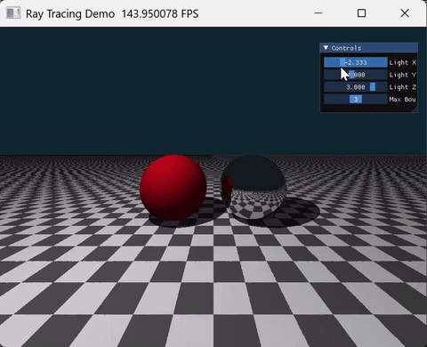
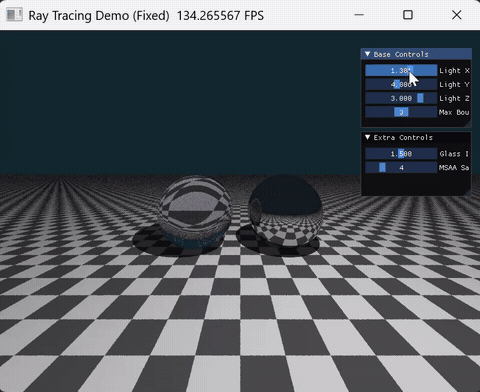

# 计算机图形学实验五——光线追踪渲染
## 学生信息
202411998340 高小涵 计算机科学与技术专业
# 1. 项目架构

本项目基于 **Python + Taichi** 框架实现，采用 **GPU 并行渲染** 架构，完整实现了**基础 Whitted-Style 光线追踪**、**硬阴影**与**镜面反射**三大核心功能，场景包含球体、平面两种几何体，支持实时参数交互调节，并拓展实现了玻璃折射材质与 MSAA 抗锯齿两项选做功能。

项目架构
```plaintext 
CG-Lab_2026/
└── src/
    └── Work5/
        ├── basic.py          # 基础实验源码：迭代式光线追踪 + 硬阴影 + 镜面反射
        ├── extra.py          # 选做实验整合源码：玻璃折射 + MSAA抗锯齿完整实现
        └──  README.md         # 项目实验说明文档
```

核心架构设计

| 模块               | 职责                                                         | 技术特点                                                     |
| ------------------ | ------------------------------------------------------------ | ------------------------------------------------------------ |
| **光线几何求交层** | 封装球体、水平无限平面两种基础几何体的光线相交检测逻辑，求解射线交点三维坐标与表面法向量 | 基于解析几何二次方程求解，加入数值稳定性判断与有效范围约束；通过深度测试筛选最近交点，精准模拟物体前后遮挡空间关系；实现棋盘格纹理映射，赋予平面材质细节 |
| **光线追踪主循环层** | 将传统递归光线追踪改写为迭代式实现，适配 GPU 并行计算；追踪光线路径，处理反射、折射、漫反射材质分支 | 定义光线能量吞吐量（Throughput）记录光强衰减；通过 `for` 循环控制光线最大弹射次数，避免递归开销；对镜面/玻璃材质持续追踪，漫反射材质终止追踪 |
| **阴影与光照计算层** | 基于阴影射线（Shadow Ray）原理实现硬阴影判定，引入法线微小偏移策略解决自遮挡伪阴影瑕疵；采用简化 Phong 模型计算漫反射光照 | 对物体表面交点进行偏移采样，向光源发射检测射线，依据中间遮挡关系划分光照区与阴影区；阴影区域仅保留环境光分量，严格遵循真实物理光照遮挡规律 |
| **材质分支处理层** | 区分漫反射、镜面反射、玻璃折射三类材质，实现不同材质的光线交互逻辑 | 镜面材质基于反射定律更新光线方向；玻璃材质基于斯涅尔定律实现折射，并引入菲涅尔效应处理反射与折射的比例；漫反射材质直接计算光照并终止追踪 |
| **实时交互控制层** | 基于 Taichi 内置 UI 面板搭建交互式参数控制台，提供光源位置、光线弹射次数、玻璃折射率、抗锯齿采样数等多维度参数调节 | 支持光源三维坐标、最大弹射次数、玻璃折射率、MSAA 采样数实时拖拽调节，参数变更即时反馈到渲染画面，实现所见即所得的交互体验 |
| **画面渲染输出层** | 预分配固定分辨率像素显存缓冲区，GPU 并行完成像素颜色填充与画面刷新，引入 MSAA 抗锯齿优化画面质量 | 固定 800×600 窗口分辨率，采用颜色钳位约束 RGB 值域在 0~1 之间，画面过渡自然、无色彩溢出；通过像素内随机采样与颜色平均消除物体边缘锯齿 |

# 2. 代码逻辑

## 2.1 基础版（basic.py）核心逻辑

**核心算法**：迭代式 Whitted-Style 光线追踪 + 硬阴影 + 镜面反射
本文件为实验基础核心实现，不包含选做拓展功能，仅完成标准光线追踪、硬阴影与镜面反射流程。

1. **相机视线射线生成**
   以屏幕每个像素为映射载体，将二维屏幕坐标归一化映射到三维空间，以摄像机位置为射线原点，生成归一化视线方向射线，为后续几何求交提供基础。

2. **几何体光线求交与纹理映射**
   分别实现射线与球体、水平无限平面的解析求交运算：通过构建一元二次方程求解交点距离，同时计算几何体表面归一化法向量；对平面额外实现棋盘格纹理映射，通过交点 x、z 坐标的奇偶性判断颜色，赋予平面材质细节。

3. **深度测试与遮挡筛选**
   记录射线与所有几何体的有效交点距离，通过比对保留距离摄像机最近的交点，实现球体与平面之间正确的前后遮挡逻辑，还原三维空间层次关系。

4. **迭代式光线追踪主循环**
   定义光线能量吞吐量 `throughput` 记录光强衰减，采用 `for` 循环控制光线最大弹射次数，避免递归开销：击中镜面物体时，更新光线起点与方向，持续追踪反射光线；击中漫反射物体时，计算光照并终止追踪。

5. **硬阴影检测与光照计算**
   从物体表面交点沿法向量方向做微小偏移，消除阴影射线起点与表面重合导致的自遮挡伪阴影问题；从偏移采样点向点光源方向发射阴影检测射线，若存在有效交点则判定当前点处于阴影区域；阴影区域仅保留环境光分量，光照正常区域则执行漫反射光照计算，形成边界锐利的硬阴影效果。

6. **颜色合成与画面输出**
   将各次光线弹射的光照分量按能量权重叠加，通过数值钳位约束颜色合法区间，最终写入像素缓冲区完成单帧渲染。

**渲染流程**

1. 初始化 Taichi GPU 计算后端，定义窗口分辨率、像素存储场与全局交互参数场；
2. 进入主渲染循环，调用 Taichi 核函数逐像素并行执行光线追踪与光照计算；
3. 依次完成视线射线生成、几何体求交、深度筛选、迭代式光线追踪、硬阴影检测与光照计算；
4. 搭建 UI 交互子窗口，绑定滑块控件与光源位置、最大弹射次数参数；
5. 持续刷新画布，实时渲染三维场景并响应参数变化。

## 2.2 选做整合版（extra.py）核心逻辑

本文件在 **basic.py 完整基础功能** 之上，一次性集成**两项选做任务**：玻璃折射材质实现 + MSAA 抗锯齿优化，保留原有全部几何求交、光线追踪、交互逻辑，仅新增折射计算、菲涅尔效应与多采样抗锯齿模块。

### 选做1：玻璃折射材质实现

**问题背景**
基础版本仅支持漫反射与镜面反射材质，无法模拟透明物体的折射效果，场景中玻璃、水等透明材质无法真实呈现，物理真实感不足。

**核心实现原理**
引入斯涅尔定律（Snell's Law）计算折射光线方向，同时结合菲涅尔效应处理反射与折射的比例：
1.  根据入射光线方向、表面法向量与介质折射率，计算折射光线方向，并处理全内反射情况；
2.  基于施利克近似（Schlick's Approximation）实现菲涅尔效应，模拟光线在玻璃表面反射与折射的能量分配；
3.  随机决定光线是发生反射还是折射，实现玻璃材质的半透明与反射效果；
4.  玻璃表面交点同样进行法线微小偏移，避免自相交伪影。

### 选做2：MSAA 抗锯齿优化

**问题背景**
单采样模式下，物体边缘像素采样不足，存在明显的锯齿现象，画面平滑度不足，影响视觉观感。

**核心实现原理**
在每个像素内随机发射多条主光线（采样数由交互滑块控制），并将所有采样的颜色取平均值：
1.  为每个采样在像素内添加随机偏移，打破规则采样的周期性；
2.  对所有采样的颜色值进行累加并取平均，实现物体边缘的平滑过渡；
3.  采样数支持实时调节，可在渲染质量与性能之间灵活权衡。

**整体逻辑**
extra.py 完全复用基础版的几何体求交、光线追踪、UI 交互框架，仅新增折射计算、菲涅尔效应与多采样抗锯齿模块，代码耦合度低、拓展性强，同时满足基础实验与两项选做的全部考核要求。

# 3. 实现功能

## 3.1 基础功能

1. **三维场景光线追踪渲染**
   基于迭代式光线追踪算法，完整实现红色漫反射球体、银色镜面球体与棋盘格地板的三维场景渲染，几何造型准确、轮廓完整。

2. **硬阴影渲染**
   基于阴影射线原理实现硬阴影效果，物体之间的光线遮挡关系清晰，阴影边界锐利，画面三维立体感大幅提升；通过法线微小偏移策略消除自遮挡伪阴影与黑斑噪点。

3. **镜面反射效果**
   基于反射定律实现理想镜面反射，银色镜面球体可反射地板与周围物体的倒影，通过控制光线最大弹射次数实现“镜中世界”的多次反射效果。

4. **GPU 并行加速渲染**
   借助 Taichi 核函数实现逐像素并行计算，800×600 分辨率下渲染全程流畅无卡顿，充分发挥 GPU 并行计算优势。

5. **棋盘格纹理映射**
   对水平无限平面实现黑白棋盘格纹理，通过交点 x、z 坐标的奇偶性判断颜色，赋予平面丰富的材质细节。

6. **渲染容错与颜色约束**
   采用向量归一化、光照负值截断、RGB 颜色区间钳位等优化手段，彻底解决画面黑斑、高光过曝、光照翻转等渲染异常问题。

## 3.2 选做1：玻璃折射材质实现

1. **斯涅尔定律折射计算**
   基于斯涅尔定律实现折射光线方向的计算，同时处理全内反射情况，真实模拟光线穿过玻璃的折射效果。

2. **菲涅尔效应模拟**
   引入施利克近似实现菲涅尔效应，模拟光线在玻璃表面反射与折射的能量分配，玻璃材质同时具备反射与折射效果，更贴近真实物理特性。

3. **折射率实时调节**
   支持通过交互滑块调节玻璃材质的折射率，观察不同折射率下折射效果的变化，直观理解折射率对透明材质的影响。

4. **全功能向下兼容**
   完全适配原有场景布局、交互逻辑，无需改动基础架构即可无缝替换材质。

## 3.3 选做2：MSAA 抗锯齿优化

1. **多采样随机抗锯齿**
   每个像素内随机发射多条主光线，通过颜色平均消除物体边缘锯齿，画面平滑度显著提升。

2. **采样数实时调节**
   支持通过交互滑块调节 MSAA 采样数（1~16倍），可在渲染质量与性能之间灵活权衡，直观观察采样数对画面平滑度的影响。

3. **无额外性能瓶颈**
   依托 Taichi GPU 并行计算优势，多采样渲染仍能保持流畅帧率，无明显卡顿。

## 3.4 交互式调节功能

1. **多参数实时滑块控制**
   支持光源三维坐标（Light X/Y/Z）、光线最大弹射次数（Max Bounces）、玻璃折射率（Glass IOR）、MSAA 采样数（MSAA Samples）等核心参数自由拖动调节。

2. **参数动态即时预览**
   滑块参数变更实时同步到光线追踪与光照计算逻辑，渲染画面即时刷新，直观观察各参数对物体光影、反射/折射效果、画面平滑度的影响。

3. **窗口稳定运行适配**
   程序窗口常驻渲染，支持正常拖拽、缩放与最小化，运行稳定无崩溃、无画面卡顿闪烁。

# 4. 效果展示

## 4.1 基础版 basic.py 运行效果

- 效果描述：成功渲染红色漫反射球体、银色镜面球体与棋盘格地板，基于简化 Phong 模型生成环境光与漫反射光照；镜面球体反射出地板与周围物体的倒影，光线最大弹射次数为3时可看到多次反射的“镜中世界”；球体在地板上投射出边界清晰的硬阴影，阴影区域仅保留环境光，明暗对比强烈。
- 交互效果：可通过右侧控制面板滑块实时调节光源位置与光线最大弹射次数，画面随参数变化动态刷新，交互响应流畅。
- 效果截图：
  

## 4.2 选做整合版 extra.py 运行效果

- 效果描述：在保留基础场景与光影基调的前提下，将左侧球体替换为玻璃折射材质，可清晰看到透过玻璃球扭曲的棋盘格背景，同时玻璃球表面带有微弱反射效果，符合菲涅尔效应的物理特性；通过 MSAA 抗锯齿优化，物体边缘锯齿显著减少，画面更加平滑；可通过滑块调节玻璃折射率与 MSAA 采样数，直观观察参数变化对画面效果的影响。
- 功能覆盖：同时集齐基础光线追踪、硬阴影、镜面反射、玻璃折射、MSAA 抗锯齿五大核心内容，完全满足实验基础+两项选做的全部要求。
- 效果截图：
  

# 5. 实验结果对比分析

## 5.1 基础实验效果（basic.py）

1. 成功渲染红色漫反射球体、银色镜面球体与棋盘格地板，场景层次清晰；
2. 硬阴影效果正常，球体在地板上投射出边界锐利的阴影，遮挡关系明确；
3. 镜面反射效果显著，镜面球体可反射地板与周围物体的倒影，最大弹射次数越高，反射层次越丰富；
4. 滑块可正常调节光源位置与光线最大弹射次数，交互流畅，参数变化对画面的影响直观可见。

## 5.2 选做拓展效果

1. **玻璃折射效果对比**
   - 无折射：物体仅呈现反射效果，无法模拟透明材质的光学特性；
   - 有折射：透过玻璃球可看到被扭曲的背景，玻璃材质同时具备反射与折射效果，更贴近真实物理表现；调节折射率可改变折射程度，直观理解斯涅尔定律的应用。

2. **MSAA 抗锯齿效果对比**
   - 单采样：物体边缘存在明显锯齿，画面平滑度不足；
   - 多采样（4倍及以上）：物体边缘锯齿显著减少，画面过渡更加平滑，视觉观感大幅提升；采样数越高，平滑度越好，但渲染耗时略有增加。

## 5.3 参数调节作用

- **光源位置（Light X/Y/Z）**：控制点光源的三维坐标，光源移动时阴影的位置与方向同步变化，可直观观察光照方向对物体光影的影响；
- **最大弹射次数（Max Bounces）**：控制光线的最大反射/折射次数，次数为1时无镜面反射效果，次数越高，镜面反射的层次越丰富，玻璃折射的效果也更完整；
- **玻璃折射率（Glass IOR）**：控制玻璃材质的折射率，数值越大，光线穿过玻璃时的折射程度越强，背景扭曲效果越明显；
- **MSAA 采样数（MSAA Samples）**：控制每个像素的采样次数，数值越大，画面平滑度越好，但渲染耗时也会相应增加，可根据需求在质量与性能之间权衡。

---
