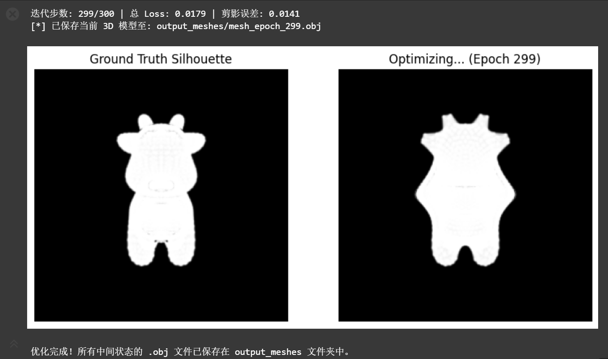

# 实验六  ——  可微光栅化三维网格形变实验

## 学生信息 
202411998340 高小涵 计算机科学与技术专业

# 1. 项目架构
## 目录结构
```
MeshDeform_SoftRasterization/
├── images                       # 存放图片
├── cow.obj                      # 目标奶牛三维网格模型（真值Mesh）
├── mesh_optimize.ipynb          # 主实验完整代码
├── output_meshes/               # 自动生成：每轮迭代中间网格obj文件
│   ├── mesh_epoch_000.obj
│   ├── mesh_epoch_020.obj
│   └── ...
└── README.md                    # 项目说明文档（本文档）
```
## 模块分层架构
1. **数据加载模块**：加载目标奶牛Mesh、归一化预处理、生成多视角摄像机；
2. **可微渲染管线模块**：软光栅化Rasterizer + SoftSilhouetteShader剪影着色器；
3. **初始化模块**：生成初始细分球体网格、创建可微顶点偏移参数；
4. **损失计算模块**：剪影重建MSE损失 + 三项网格正则损失；
5. **梯度优化模块**：SGD/Adam优化器反向传播更新网格顶点；
6. **可视化输出模块**：迭代剪影对比绘图、中间三维模型本地保存。

# 2. 代码逻辑与关键模块说明
## （1） 环境与依赖初始化
自动检测CUDA加速设备，导入PyTorch3D网格、渲染、损失全套工具包，打印运行环境版本便于调试。
```python
device = torch.device("cuda:0" if torch.cuda.is_available() else "cpu")
```

## （2） 目标真值Mesh加载与多视角真值剪影生成
1. `load_obj`读取奶牛obj网格，对顶点中心化+尺度归一化，统一模型尺寸；
2. `look_at_view_transform`生成20个环绕水平旋转摄像机，覆盖物体全部侧面视角；
3. **软光栅核心**：`SoftSilhouetteShader`实现软边界Sigmoid平滑过渡，解决传统硬光栅梯度消失问题；
4. 批量渲染全部视角真值剪影`target_silhouette`，作为监督标签。

## （3） 初始球体网格与可形变参数定义
- `ico_sphere(4)`生成4级细分球体，作为优化初始源网格；
- `deform_verts`：与球体顶点同尺寸零张量，设置`requires_grad=True`，作为唯一可训练参数，通过偏移原始球体顶点实现网格形变；
```python
src_mesh = ico_sphere(4, device)
deform_verts = torch.zeros_like(src_mesh.verts_packed(), requires_grad=True)
```

## （4） 总损失函数
$$L_{total} = L_{silhouette} + w_{lap}L_{lap} + w_{edge}L_{edge} + w_{normal}L_{normal}$$
1. **剪影重建损失 $L_{silhouette}$**：多视角预测剪影与真值剪影MSE误差，驱动网格贴合目标外形；
2. **拉普拉斯平滑 $L_{lap}$**：约束相邻顶点坐标平滑，抑制表面尖锐凸起；
3. **边长一致性惩罚 $L_{edge}$**：约束三角形边长均匀，避免网格拉伸、面片坍塌；
4. **法线一致性 $L_{normal}$**：约束相邻三角面片法线方向接近，保证曲面光滑连续；

## （5） 梯度下降优化循环
1. 每轮清空梯度，使用偏移量更新原始球体网格`offset_verts`；
2. 前向传播渲染当前网格多视角剪影，计算总损失；
3. `loss.backward()`反向传播得到顶点偏移梯度，优化器更新形变参数；
4. 间隔迭代可视化剪影对比图，保存当前三维网格至本地obj文件。

# 3. 项目实现功能
1. **软可微光栅化渲染**：通过Sigmoid平滑边界，解决硬光栅边界梯度消失，支持网格梯度反向传播；
2. **多视角剪影监督拟合**：20个环绕视角联合约束，保证三维外形多角度匹配；
3. **三重网格正则约束**：同时平滑曲面、约束边长、统一法线，防止网格交叉、塌陷、拓扑崩坏；
4. **完整网格形变优化流程**：球体→奶牛端到端梯度下降优化；
5. **实时可视化监控**：迭代过程输出「真值剪影vs预测剪影」灰度对比图；
6. **中间模型持久化**：自动保存每20轮迭代三维网格obj文件，可使用Blender/Meshlab打开查看形变全过程；
7. **跨设备兼容**：自动适配NVIDIA CUDA加速，无GPU时自动切换CPU运行。

# 4. 可调超参数与不同参数效果展示
## （1） 全部可修改关键参数
| 参数分类 | 参数名称 | 代码位置 | 默认值 | 参数作用 |
| ---- | ---- | ---- | ---- | ---- |
| 渲染视角 | num_views | 摄像机配置段 | 20 | 多视角监督数量，越大拟合精度越高、速度越慢 |
| 图像分辨率 | image_size | RasterizationSettings | 256 | 剪影渲染分辨率，越高轮廓细节越清晰 |
| 软光栅模糊度 | blur_radius / sigma | 光栅/着色器 | 1e-4 | σ控制边界平滑程度，值越大梯度越稳定，剪影边缘越模糊 |
| 初始球体细分等级 | ico_sphere(4) | 网格初始化 | 4 | 细分越高网格顶点越多，形变细节更强，显存占用上升 |
| 迭代总轮数 | epochs | 优化循环 | 300 | 迭代步数，步数不足会欠拟合，过大会过拟合 |
| 学习率 | lr | SGD/Adam优化器 | 1.0(SGD) | 学习率过大震荡不收敛，过小收敛缓慢 |
| 正则权重-w_lap | lap损失系数 | loss计算公式 | 1.0 | 拉普拉斯平滑强度，越大曲面越光滑，外形拟合能力下降 |
| 正则权重-w_edge | edge损失系数 | loss计算公式 | 0.1 | 边长约束强度，越大网格面片越均匀 |
| 正则权重-w_normal | normal损失系数 | loss计算公式 | 0.01 | 法线平滑强度，越大曲面越圆润 |

## （2） 多组参数对照实验方案
### 实验组1：正则化权重对比（有无正则差异）
1. 对照组：关闭全部正则（权重全部置0）
    ```python
    loss = loss_silhouette + 0 * mesh_laplacian_smoothing(...) + 0 * mesh_edge_loss(...) + 0 * mesh_normal_consistency(...)
    ```
    效果：网格无约束，顶点疯狂交叉重叠，剪影出现毛刺、网格塌陷（局部最优）；
2. 标准组：默认正则权重 `1.0 / 0.1 / 0.01`
    效果：网格光滑，剪影轮廓贴合奶牛外形，无尖锐毛刺；
3. 强拉普拉斯组：`w_lap=10.0`
    效果：曲面过度平滑，丢失牛角、四肢等细节，剪影轮廓模糊。

### 实验组2：软光栅σ模糊参数对比
1. 小sigma `sigma=1e-5`：边界接近硬光栅，梯度微弱，收敛极慢，300轮仍欠拟合；
2. 默认`sigma=1e-4`：平衡梯度平滑与轮廓精度；
3. 大sigma `sigma=1e-3`：剪影边缘严重模糊，外形细节丢失。

### 实验组3：网格细分等级对比
1. 低细分 `ico_sphere(2)`：顶点数量少，无法拟合牛角、四肢精细结构；
2. 默认 `ico_sphere(4)`：顶点充足，完整还原奶牛外形；
3. 高细分 `ico_sphere(5)`：顶点过多，显存占用翻倍，训练速度大幅下降。

## （3） 标准收敛效果参考
迭代299轮标准输出：
- 迭代步数: 299/300 | 总 Loss: 0.0179 | 剪影误差: 0.0141
- 左图：Ground Truth Silhouette（奶牛真值剪影）
- 右图：Optimizing... (Epoch 299)（优化后球体剪影）

<div align="center">
    
    <p>标准收敛效果</p>
</div>

# 5. 运行说明
1. 将`cow.obj`与`mesh_optimize.py`放在同一文件夹；
2. 终端执行：`python mesh_optimize.py`；
3. 自动创建`output_meshes`文件夹保存所有迭代网格；
4. 运行过程弹出Matplotlib剪影对比窗口，实时查看拟合进度。

# 6. 实验核心结论
1. 硬光栅边界阶跃变化会导致梯度消失，软光栅通过Sigmoid距离加权实现平滑梯度，支撑网格形变优化；
2. 仅依靠剪影重建损失会使网格陷入局部最优、面片交叉塌陷，拉普拉斯、边长、法线三重正则是保证网格拓扑合理性的关键；
3. 多视角联合监督能够约束三维空间网格，仅靠单视角剪影会出现深度歧义，无法还原完整三维外形。

# 7. 备注
## 可配置超参数区 
- num_views = 20
- image_size = 256
- blur_sigma = 1e-4
- sphere_subdiv = 4
- epochs = 300
- lr = 1e-3
## 正则权重
- w_lap = 1.0
- w_edge = 0.1
- w_normal = 0.01

