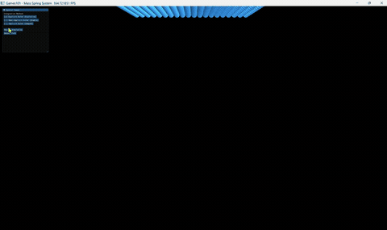
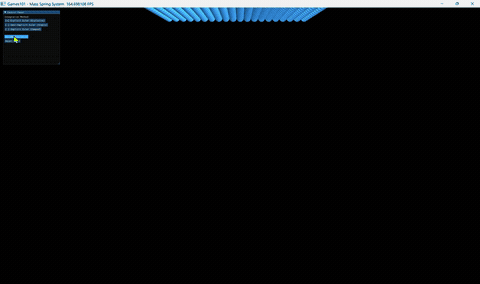
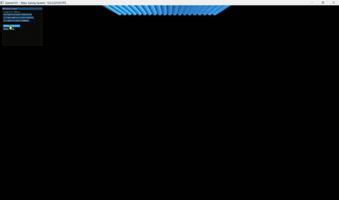

# 计算机图形学实验七 - 质点弹簧布料模拟

## 学生信息
202411998340 高小涵 计算机科学与技术专业

# 1. 项目架构

```
Work7/
├─ mass_spring_cloth.py            # 主程序入口，基础部分
├─ extra.py                   # 主程序入口，拓展部份
├─ README.md
└─ images                     # 所有可视化图片
```
架构约束说明：
1. 所有初始化操作拆分为独立`@ti.kernel`，Python串行调用保证GPU状态同步；
2. 力学工具使用`ti.func`编译期内联，消除GPU函数调用开销；
3. 每个积分求解器将受力计算、状态更新合并为单一Kernel，最小Kernel启动次数。

# 2. 代码逻辑 & 关键模块说明
## （1） 全局数据场模块
存储布料模拟全部GPU并行数据，分为4类：
1. 质点状态场：`x`位置、`v`速度、`f`瞬时受力、`is_fixed`固定约束标记；
2. 隐式欧拉迭代缓存场：`x_next/v_next/f_next`，存储迭代预测状态；
3. 弹簧拓扑场：`spring_pairs`弹簧两端质点索引、`spring_lengths`弹簧原长、`num_springs`弹簧总数、`spring_indices`渲染画线索引；
4. 全局物理超参数：网格分辨率N、质点质量、时间步dt、劲度系数ks、阻尼kd、重力、速度上限。

## （2） 初始化模块
`init_cloth()`为Python层统一初始化入口，按固定顺序串行调用3个Kernel，规避GPU异步计算不同步问题：
1. `init_positions`：生成N×N网格布料，左上角、右上角质点设为固定悬挂点，其余质点自由下落；
2. `init_springs`：遍历网格生成**横向+纵向结构弹簧**，使用`ti.atomic_add`自动统计弹簧总数，记录弹簧静止原长；
3. `init_spring_indices`：将弹簧二元索引平铺为渲染管线所需一维索引数组，用于3D线框绘制。

## （3） 力学计算工具函数（ti.func）
### compute_forces_on()
分两阶段并行计算受力：
1. 遍历所有质点，叠加重力与线性阻尼力；
2. 遍历全部弹簧，基于胡克定律计算弹力，使用`ti.atomic_add`原子操作累加受力，解决多线程同时读写同一质点受力的冲突问题。
胡克弹力公式：
$$f_a = -k_s(|x_a - x_b| - l)\frac{x_a - x_b}{|x_a - x_b|}$$
阻尼力公式：
$$f_d = -k_d v_a$$

### clamp_velocity()
数值防爆核心逻辑：计算质点速度模长，若超过`max_velocity`阈值，将速度缩放至阈值内，抑制显式欧拉高速发散问题。

## （4） 三大积分求解Kernel（实验核心）
所有求解器统一在单个Kernel内完成「受力计算+状态更新」，减少GPU内核启动开销：
1. **显式欧拉 Explicit Euler**
   先用当前时刻速度更新位置，再用当前受力更新速度；稳定性最差，大步长/低阻尼极易布料飞散爆炸。
   $$x_{t+1}=x_t+v_t\Delta t,\quad v_{t+1}=v_t+a_t\Delta t$$
2. **半隐式欧拉 Semi-Implicit Euler**
   先更新速度，再用更新后的新速度更新位置；能量耗散适中，稳定性远优于显式，为本实验默认方法。
   $$v_{t+1}=v_t+a_t\Delta t,\quad x_{t+1}=x_t+v_{t+1}\Delta t$$
3. **隐式欧拉 Implicit Euler**
   采用定点迭代法近似求解未来时刻受力，迭代更新预测场`x_next/v_next`，迭代完成后回写真实状态；数值稳定性最强，布料运动阻尼感更强。

## （5） GGUI交互与渲染模块
1. 3D渲染管线：创建透视相机、环境光+点光源，绘制质点粒子+弹簧线框；支持鼠标右键拖拽旋转视角观察布料；
2. 交互控制面板功能：
   - 三种积分器一键切换，切换时自动重置布料模拟；
   - 模拟暂停/继续开关；
   - 一键重置布料初始状态；
3. 物理子步：每帧循环执行40次微小时间步更新，提升模拟平滑度与稳定性。

# 3. 完整实现功能
## （1） 基础物理模拟功能
1. N×N网格布料质点弹簧系统，横向、纵向结构弹簧拓扑；
2. 重力、线性阻尼、胡克弹簧弹力完整力学求解；
3. 速度钳制防爆机制，抑制显式欧拉数值发散；
4. 左上角、右上角双点悬挂布料约束，模拟垂坠布料效果。

## （2） 三种数值积分求解器对比
- 显式欧拉：低成本、不稳定，低阻尼下极易爆炸；
- 半隐式欧拉：平衡性能与稳定性，日常模拟首选；
- 隐式欧拉：高稳定、强阻尼，大劲度系数下不会发散。

## （3） 可视化与交互功能
1. 3D实时渲染：蓝色质点+灰色弹簧线框；
2. GGUI图形控制面板，实时切换积分算法；
3. 模拟暂停、一键重置布料；
4. 鼠标右键拖拽3D相机自由旋转观察布料；
5. GPU并行加速，大规模质点实时流畅模拟。

## （4） 工程规范实现
1. 初始化拆分为多独立Kernel，Python串行调用保证GPU同步；
2. 力学工具使用`ti.func`内联优化，减少GPU调用开销；
3. 弹簧受力累加使用`ti.atomic_add`解决多线程写冲突；
4. 受力计算+积分更新合并至单一Kernel，最小化内核启动次数。

# 4. 效果展示（可修改参数与对应现象说明）
## （1） 可调核心参数列表（直接修改代码顶部变量即可）
```python
N = 20             # 布料网格分辨率 N x N
mass = 1.0         # 质点质量
dt = 5e-4          # 单步时间步长
k_s = 10000.0      # 弹簧劲度系数（越大布料越硬）
k_d = 1.0          # 全局阻尼系数（越大运动衰减越快）
max_velocity = 50.0# 速度上限防爆阈值
```

## （2） 分组对照实验
### 对照1：阻尼系数 k_d 变化（固定ks=10000，dt=5e-4，半隐式欧拉）
1. `k_d = 1.0`
   现象：布料摆动幅度大，垂坠后持续小幅晃动，能量衰减慢；
   截图要点：布料下落、左右摆动幅度明显。
2. `k_d = 5.0`
   现象：高阻尼，布料下落几乎无回弹，快速静止，运动僵硬；
   截图要点：布料平缓下垂，几乎不摆动。

| k_d=1.0 | k_d=5.0 |
|--------|--------|
|  |  |

### 对照2：弹簧劲度系数 k_s 变化（固定kd=1，半隐式欧拉）
1. `k_s = 2000`（低劲度）
   现象：布料柔软，拉伸变形明显，垂坠褶皱多；
2. `k_s = 20000`（高劲度）
   现象：布料坚硬接近刚体，几乎无拉伸，褶皱极少。

| k_s=2000 | k_s=10000 | k_s=20000 |
|--------|--------|--------|
|  |  |  |

### 对照3：三种积分算法对比（固定kd=1，ks=10000，dt=5e-4）
1. 显式欧拉 Explicit Euler
   现象：运行短时间后布料速度溢出、质点飞散、数值爆炸；
   截图要点：布料扭曲、质点飞出画面。
2. 半隐式欧拉 Semi-Implicit Euler
   现象：稳定流畅摆动，布料自然垂坠，无发散（基准效果）；
3. 隐式欧拉 Implicit Euler
   现象：稳定性最强，摆动衰减更快，运动柔和，无爆炸。

### 对照4：时间步长 dt 变化（半隐式欧拉）
1. `dt = 1e-4`（大步长）：轻微抖动，极限下会不稳定；
2. `dt = 10e-4`（小步长）：模拟极度平滑，计算耗时小幅上升。

| dt=1e-4 | dt=5e-4 | dt=10e-4 |
|--------|--------|--------|
|  |  |  |

# 5. 运行说明
## 环境依赖
```bash
pip install taichi
```
## 启动命令
```bash
python mass_spring_cloth.py
```
## 操作方式
1. 鼠标右键按住拖拽：旋转3D相机观察布料；
2. 左侧控制面板：切换积分器、暂停模拟、重置布料；
3. 修改代码顶部参数，重启程序查看不同物理效果。

# 6. 实验总结
1. 显式欧拉仅适用于极小时间步，稳定性最差，必须搭配速度钳制防爆；
2. 半隐式欧拉是布料模拟性价比最高的方案，兼顾性能与稳定；
3. 隐式欧拉通过迭代求解未来状态，鲁棒性最强，适合大刚度、大时间步场景；
4. GPU并行计算中，拆分Kernel、ti.func内联、原子操作是保证同步与性能的关键手段；
5. 阻尼与速度钳制是抑制质点弹簧系统能量累积、防止数值爆炸的核心手段。
